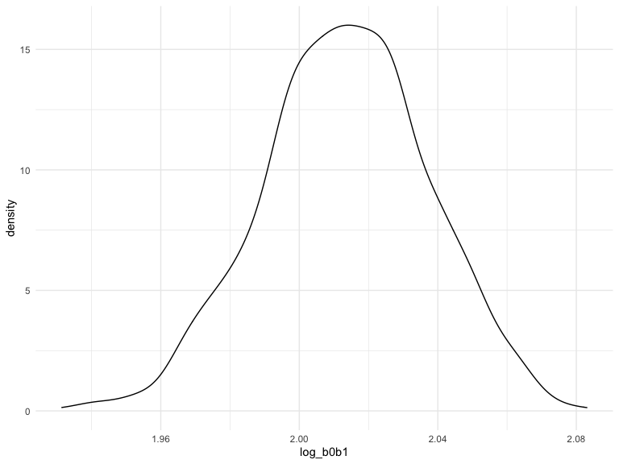

Linear Models
================
wz2631
2022-12-03

### Problem 1

To obtain a distribution for $\hat{r}^2$, we’ll follow basically the
same procedure we used for regression coefficients: draw bootstrap
samples; the a model to each; extract the value I’m concerned with; and
summarize. Here, we’ll use `modelr::bootstrap` to draw the samples and
`broom::glance` to produce `r.squared` values.

``` r
weather_df = 
  rnoaa::meteo_pull_monitors(
    c("USW00094728"),
    var = c("PRCP", "TMIN", "TMAX"), 
    date_min = "2017-01-01",
    date_max = "2017-12-31") %>%
  mutate(
    name = recode(id, USW00094728 = "CentralPark_NY"),
    tmin = tmin / 10,
    tmax = tmax / 10) %>%
  select(name, id, everything())
```

    ## Registered S3 method overwritten by 'hoardr':
    ##   method           from
    ##   print.cache_info httr

    ## using cached file: ~/Library/Caches/R/noaa_ghcnd/USW00094728.dly

    ## date created (size, mb): 2022-12-02 21:48:31 (8.426)

    ## file min/max dates: 1869-01-01 / 2022-11-30

``` r
weather_df %>% 
  modelr::bootstrap(n = 1000) %>% 
  mutate(
    models = map(strap, ~lm(tmax ~ tmin, data = .x) ),
    results = map(models, broom::glance)) %>% 
  select(-strap, -models) %>% 
  unnest(results) %>% 
  ggplot(aes(x = r.squared)) + geom_density()
```


In this example, the $\hat{r}^2$ value is high, and the upper bound at 1
may be a cause for the generally skewed shape of the distribution. If we
wanted to construct a confidence interval for $R^2$, we could take the
2.5% and 97.5% quantiles of the estimates across bootstrap samples.
However, because the shape isn’t symmetric, using the mean +/- 1.96
times the standard error probably wouldn’t work well.

We can produce a distribution for $\log(\beta_0 * \beta1)$ using a
similar approach, with a bit more wrangling before we make our plot.

``` r
weather_df %>% 
  modelr::bootstrap(n = 1000) %>% 
  mutate(
    models = map(strap, ~lm(tmax ~ tmin, data = .x) ),
    results = map(models, broom::tidy)) %>% 
  select(-strap, -models) %>% 
  unnest(results) %>% 
  select(id = `.id`, term, estimate) %>% 
  pivot_wider(
    names_from = term, 
    values_from = estimate) %>% 
  rename(beta0 = `(Intercept)`, beta1 = tmin) %>% 
  mutate(log_b0b1 = log(beta0 * beta1)) %>% 
  ggplot(aes(x = log_b0b1)) + geom_density()
```



As with $r^2$, this distribution is somewhat skewed and has some
outliers.

The point of this is not to say you should always use the bootstrap –
it’s possible to establish “large sample” distributions for strange
parameters / values / summaries in a lot of cases, and those are great
to have. But it is helpful to know that there’s a way to do inference
even in tough cases.

### Problem 2

#### Import and tidy data of data on homicides in 50 large U.S. cities.

I create a city_state variable and a binary variable indicating whether
the homicide is solved. I omit cities Dallas, TX; Phoenix, AZ; Kansas
City, MO and Tulsa, AL. Besides, I limit my analysis those for whom
victim_race is white or black. The variable victim_age is numeric.

``` r
homicide_data = 
  read_csv("./rawdata/homicide-data.csv") %>% 
  janitor::clean_names() %>% 
  mutate(
    city_state = str_c(city, ', ',state),
    victim_age = as.numeric(victim_age),
    homicide_statu =  ifelse(disposition != "Closed by arrest", 0, 1)
    ) %>% 
  filter(city_state != "Dallas, TX",
         city_state != "Phoenix, AZ",
         city_state != "Kansas City, MO",
         city_state != "Tulsa, AL") %>% 
  filter(victim_race == "White" | victim_race == "Black") %>% 
  drop_na()
```

#### Fit a logistic regression for the city of Baltimore, MD.

For the city of Baltimore, MD, I use the glm function to fit a logistic
regression with resolved vs unresolved as the outcome and victim age,
sex and race as predictors. Besides, I save the output of glm as an R
object; apply the broom::tidy to this object; and obtain the estimate
and confidence interval of the adjusted odds ratio for solving homicides
comparing male victims to female victims keeping all other variables
fixed.

``` r
baltimore_data = 
  homicide_data %>% 
  filter(city_state == "Baltimore, MD")
fit_bal_data = 
  glm(homicide_statu ~ victim_age + victim_sex + victim_race, data = baltimore_data, family = binomial) %>% 
  broom::tidy(conf.int = T, conf.level = 0.95) %>% 
  mutate(
    odds_ratio = exp(estimate),
    CI_lower = exp(estimate - 1.96 * std.error),
    CI_upper = exp(estimate + 1.96 * std.error)
  ) %>% 
  filter(term == "victim_sexMale") %>% 
  select(term, odds_ratio, CI_lower, CI_upper) %>% 
  knitr::kable(digits = 2.5)
fit_bal_data
```

| term           | odds_ratio | CI_lower | CI_upper |
|:---------------|-----------:|---------:|---------:|
| victim_sexMale |      0.426 |    0.325 |    0.558 |

The estimate of the adjusted odds ratio for solving homicides comparing
male victims to female victims is 0.426, and the confidence interval of
which is (0.325,0.558). It can be concluded that keeping all other
variables fixed, there are lower chances for homicides to be solved when
victims are male compared with that when victims are female.

#### Fit a logistic regression for each city in the dataset.

Run glm for each of the cities in the dataset, and extract the adjusted
odds ratio (and CI) for solving homicides comparing male victims to
female victims. Do this within a “tidy” pipeline, making use of
purrr::map, list columns, and unnest as necessary to create a dataframe
with estimated ORs and CIs for each city.

``` r
fit_all_data =
  homicide_data %>% 
  select(city_state, homicide_statu, victim_race:victim_sex) %>% 
  nest(data = homicide_statu:victim_sex) %>% 
  mutate(
    fit = map(data, ~glm(homicide_statu ~ victim_age + victim_sex + victim_race, data =.x, family = binomial())),
   results = map(fit, broom::tidy)
   ) %>%
  unnest(results) %>%
  mutate(
    odds_ratio_all = exp(estimate),
    CI_lower_all = exp(estimate - 1.96 * std.error),
    CI_upper_all = exp(estimate + 1.96 * std.error)
  ) %>% 
  filter(term == "victim_sexMale") %>% 
  select(term, city_state, odds_ratio_all, CI_lower_all, CI_upper_all) 
fit_all_data
```

    ## # A tibble: 47 × 5
    ##    term           city_state      odds_ratio_all CI_lower_all CI_upper_all
    ##    <chr>          <chr>                    <dbl>        <dbl>        <dbl>
    ##  1 victim_sexMale Albuquerque, NM          1.73         0.814        3.70 
    ##  2 victim_sexMale Atlanta, GA              1.00         0.684        1.46 
    ##  3 victim_sexMale Baltimore, MD            0.426        0.325        0.558
    ##  4 victim_sexMale Baton Rouge, LA          0.381        0.209        0.695
    ##  5 victim_sexMale Birmingham, AL           0.873        0.576        1.32 
    ##  6 victim_sexMale Boston, MA               0.672        0.355        1.27 
    ##  7 victim_sexMale Buffalo, NY              0.522        0.291        0.939
    ##  8 victim_sexMale Charlotte, NC            0.884        0.557        1.40 
    ##  9 victim_sexMale Chicago, IL              0.410        0.336        0.501
    ## 10 victim_sexMale Cincinnati, OH           0.400        0.236        0.677
    ## # … with 37 more rows

The dataframe with estimated odds ratios and confidence intervals for
each city is shown above.

#### Create a plot that shows the estimated ORs and CIs for each city. Organize cities according to estimated OR, and comment on the plot.

``` r
fit_all_data %>%
  ggplot(aes(x = fct_reorder(city_state, odds_ratio_all), y = odds_ratio_all)) +
  geom_point(size = 1) +
  geom_errorbar(aes(ymin = CI_lower_all, ymax = CI_upper_all)) +
  labs(x = "City, State",
       y = "Estimated odds ratios",
       title = "The estimated ORs and CIs for solving homicides comparing male victims to female victims in 50 cities") +
  theme(plot.title = element_text(size = 8),text = element_text(size = 6), axis.text.x = element_text(angle = 90)) 
```


### Problem 3

#### Load and clean the data for regression analysis.

``` r
birthweight_data = 
  read_csv("./rawdata/birthweight.csv") %>% 
  janitor::clean_names() %>% 
   mutate(
         babysex = factor(babysex, levels = c(1,2), labels = c("male","female")),
         frace = factor(frace, levels = c(1,2,3,4,8,9), labels = c("white","black","asian","puerto rican","other","unknown")),
         malform = factor(malform, levels = c(0,1), labels = c("absent","present")),
         mrace = factor(mrace, levels = c(1,2,3,4,8), labels = c("white","black","asian","puerto rican","other"))
         ) 

skimr::skim(birthweight_data)
```

|                                                  |                  |
|:-------------------------------------------------|:-----------------|
| Name                                             | birthweight_data |
| Number of rows                                   | 4342             |
| Number of columns                                | 20               |
| \_\_\_\_\_\_\_\_\_\_\_\_\_\_\_\_\_\_\_\_\_\_\_   |                  |
| Column type frequency:                           |                  |
| factor                                           | 4                |
| numeric                                          | 16               |
| \_\_\_\_\_\_\_\_\_\_\_\_\_\_\_\_\_\_\_\_\_\_\_\_ |                  |
| Group variables                                  | None             |

Data summary

**Variable type: factor**

| skim_variable | n_missing | complete_rate | ordered | n_unique | top_counts                              |
|:--------------|----------:|--------------:|:--------|---------:|:----------------------------------------|
| babysex       |         0 |             1 | FALSE   |        2 | mal: 2230, fem: 2112                    |
| frace         |         0 |             1 | FALSE   |        5 | whi: 2123, bla: 1911, pue: 248, asi: 46 |
| malform       |         0 |             1 | FALSE   |        2 | abs: 4327, pre: 15                      |
| mrace         |         0 |             1 | FALSE   |        4 | whi: 2147, bla: 1909, pue: 243, asi: 43 |

**Variable type: numeric**

| skim_variable | n_missing | complete_rate |    mean |     sd |     p0 |     p25 |     p50 |     p75 |   p100 | hist  |
|:--------------|----------:|--------------:|--------:|-------:|-------:|--------:|--------:|--------:|-------:|:------|
| bhead         |         0 |             1 |   33.65 |   1.62 |  21.00 |   33.00 |   34.00 |   35.00 |   41.0 | ▁▁▆▇▁ |
| blength       |         0 |             1 |   49.75 |   2.72 |  20.00 |   48.00 |   50.00 |   51.00 |   63.0 | ▁▁▁▇▁ |
| bwt           |         0 |             1 | 3114.40 | 512.15 | 595.00 | 2807.00 | 3132.50 | 3459.00 | 4791.0 | ▁▁▇▇▁ |
| delwt         |         0 |             1 |  145.57 |  22.21 |  86.00 |  131.00 |  143.00 |  157.00 |  334.0 | ▅▇▁▁▁ |
| fincome       |         0 |             1 |   44.11 |  25.98 |   0.00 |   25.00 |   35.00 |   65.00 |   96.0 | ▃▇▅▂▃ |
| gaweeks       |         0 |             1 |   39.43 |   3.15 |  17.70 |   38.30 |   39.90 |   41.10 |   51.3 | ▁▁▂▇▁ |
| menarche      |         0 |             1 |   12.51 |   1.48 |   0.00 |   12.00 |   12.00 |   13.00 |   19.0 | ▁▁▂▇▁ |
| mheight       |         0 |             1 |   63.49 |   2.66 |  48.00 |   62.00 |   63.00 |   65.00 |   77.0 | ▁▁▇▂▁ |
| momage        |         0 |             1 |   20.30 |   3.88 |  12.00 |   18.00 |   20.00 |   22.00 |   44.0 | ▅▇▂▁▁ |
| parity        |         0 |             1 |    0.00 |   0.10 |   0.00 |    0.00 |    0.00 |    0.00 |    6.0 | ▇▁▁▁▁ |
| pnumlbw       |         0 |             1 |    0.00 |   0.00 |   0.00 |    0.00 |    0.00 |    0.00 |    0.0 | ▁▁▇▁▁ |
| pnumsga       |         0 |             1 |    0.00 |   0.00 |   0.00 |    0.00 |    0.00 |    0.00 |    0.0 | ▁▁▇▁▁ |
| ppbmi         |         0 |             1 |   21.57 |   3.18 |  13.07 |   19.53 |   21.03 |   22.91 |   46.1 | ▃▇▁▁▁ |
| ppwt          |         0 |             1 |  123.49 |  20.16 |  70.00 |  110.00 |  120.00 |  134.00 |  287.0 | ▅▇▁▁▁ |
| smoken        |         0 |             1 |    4.15 |   7.41 |   0.00 |    0.00 |    0.00 |    5.00 |   60.0 | ▇▁▁▁▁ |
| wtgain        |         0 |             1 |   22.08 |  10.94 | -46.00 |   15.00 |   22.00 |   28.00 |   89.0 | ▁▁▇▁▁ |

I convert numeric to factor where appropriate and check for missing
data, confirming that there is no missing data in this dataset.

#### Propose a regression model for birthweight.

My model is based on a data-driven model-building process. I begin this
modeling with a full model containing all variables, and then use
stepwise regression to compare AIC and confirm the important variables.
According to the calculation, the regression model that best explains
the data is bwt \~ babysex + bhead + blength + delwt + fincome +
gaweeks + mheight + mrace + parity + ppwt + smoken.

``` r
full_model = lm(bwt ~., data = birthweight_data)
stepwise_model = step(full_model, direction = "both", trace = FALSE)
summary(stepwise_model)
```

    ## 
    ## Call:
    ## lm(formula = bwt ~ babysex + bhead + blength + delwt + fincome + 
    ##     gaweeks + mheight + mrace + parity + ppwt + smoken, data = birthweight_data)
    ## 
    ## Residuals:
    ##      Min       1Q   Median       3Q      Max 
    ## -1097.18  -185.52    -3.39   174.14  2353.44 
    ## 
    ## Coefficients:
    ##                     Estimate Std. Error t value Pr(>|t|)    
    ## (Intercept)       -6098.8219   137.5463 -44.340  < 2e-16 ***
    ## babysexfemale        28.5580     8.4549   3.378 0.000737 ***
    ## bhead               130.7770     3.4466  37.944  < 2e-16 ***
    ## blength              74.9471     2.0190  37.120  < 2e-16 ***
    ## delwt                 4.1067     0.3921  10.475  < 2e-16 ***
    ## fincome               0.3180     0.1747   1.820 0.068844 .  
    ## gaweeks              11.5925     1.4621   7.929 2.79e-15 ***
    ## mheight               6.5940     1.7849   3.694 0.000223 ***
    ## mraceblack         -138.7925     9.9071 -14.009  < 2e-16 ***
    ## mraceasian          -74.8868    42.3146  -1.770 0.076837 .  
    ## mracepuerto rican  -100.6781    19.3247  -5.210 1.98e-07 ***
    ## parity               96.3047    40.3362   2.388 0.017004 *  
    ## ppwt                 -2.6756     0.4274  -6.261 4.20e-10 ***
    ## smoken               -4.8434     0.5856  -8.271  < 2e-16 ***
    ## ---
    ## Signif. codes:  0 '***' 0.001 '**' 0.01 '*' 0.05 '.' 0.1 ' ' 1
    ## 
    ## Residual standard error: 272.3 on 4328 degrees of freedom
    ## Multiple R-squared:  0.7181, Adjusted R-squared:  0.7173 
    ## F-statistic: 848.1 on 13 and 4328 DF,  p-value: < 2.2e-16

``` r
fit_model = lm(bwt ~ babysex + bhead + blength + delwt + fincome + gaweeks + mheight + mrace + parity + ppwt + smoken, data = birthweight_data)
birthweight_data %>% 
  add_residuals(fit_model) %>%
  add_predictions(fit_model) %>% 
  ggplot(aes(x = pred, y = resid)) +
  geom_point(alpha  = .2) +
  geom_smooth() +
  labs(x = "Fitted Values",
       y = "Residuals",
       title = "A regression model for children's birthweights") +
  theme(plot.title = element_text(size = 10),text = element_text(size = 8)) 
```

    ## `geom_smooth()` using method = 'gam' and formula 'y ~ s(x, bs = "cs")'


#### Compare this model to two others.

``` r
model_1 = lm(bwt ~ blength + gaweeks, data = birthweight_data)
model_2 = lm(bwt ~ (bhead + blength + babysex)^3, data = birthweight_data)

cv_pre_error = 
  crossv_mc(birthweight_data, 100) %>% 
  mutate(
    train = map(train, as_tibble),
    test = map(test, as_tibble),
    model_x  = map(.x = train, ~lm(bwt ~ babysex + bhead + blength + delwt + fincome + gaweeks + mheight + mrace + parity + ppwt + smoken, data = .x)),
    model_1  = map(.x = train, ~lm(bwt ~ blength + gaweeks, data = .x)),
    model_2  = map(.x = train, ~lm(bwt ~ (bhead + blength + babysex)^3, data = .x))
    ) %>% 
  mutate(
    rmse_model_x = map2_dbl(.x = model_x, .y = test, ~rmse(model = .x, data = .y)),
    rmse_model_1 = map2_dbl(.x = model_1, .y = test, ~rmse(model = .x, data = .y)),
    rmse_model_2 = map2_dbl(.x = model_2, .y = test, ~rmse(model = .x, data = .y))
    )
```
